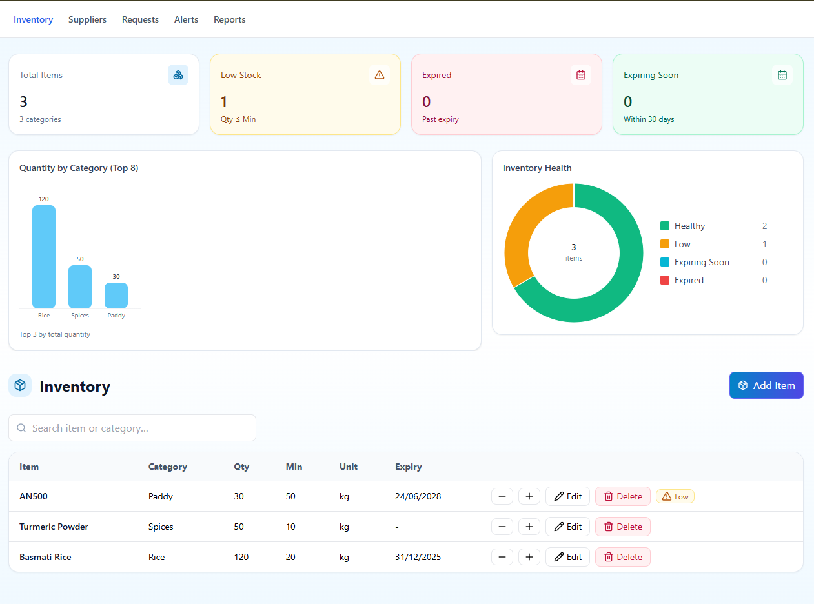
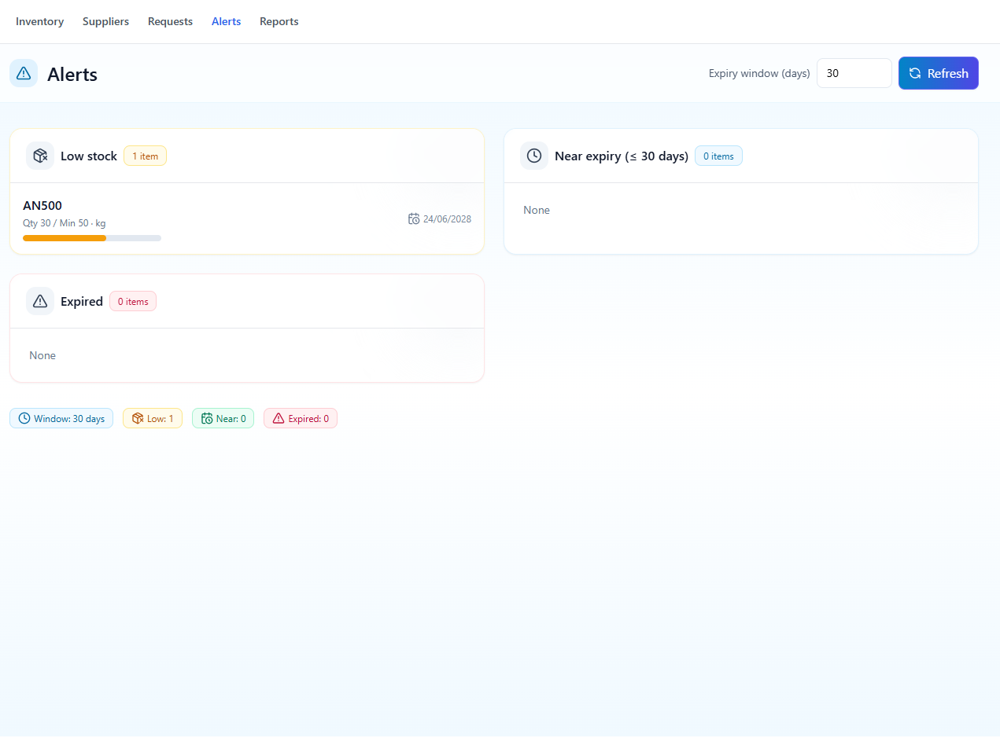
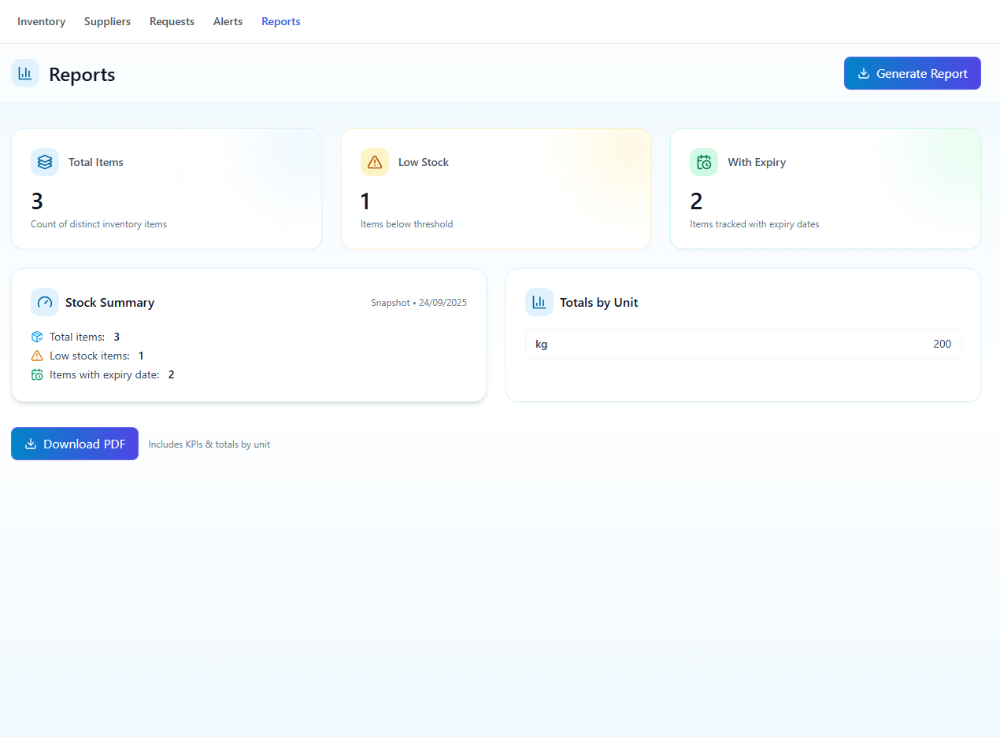

# 📦 Inventory Management Dashboard

A modern web-based dashboard for managing inventory, suppliers, requests, alerts, and reports.  
This system provides real-time insights into stock levels, expiry tracking, and supply chain management, all in a clean and responsive UI.

---

## 🚀 Features

- **Inventory Management**
  - Add, edit, delete items with categories, units, quantities, thresholds, and expiry dates.
  - Automatic alerts for low stock, expired, and near-expiry items.
  - Visual analytics with bar charts and pie charts (stock distribution, inventory health).

- **Supplier & Request Handling**
  - Manage supplier data and track requests efficiently.
  - Role-based workflows for suppliers and admins.

- **Alerts**
  - Instant insights into stock issues (low, near expiry, expired).
  - Clear categorization with color-coded alerts.

- **Reports**
  - Generate summary reports of stock and suppliers.
  - Export reports as **PDF** with KPIs and totals by unit.

- **Responsive UI**
  - Built with modern React + Tailwind for a seamless desktop experience.
  - Clean, minimal, and user-friendly interface.

---

## 📸 Screenshots

### Inventory Dashboard


### Alerts View


### Reports View


---

## 🛠️ Tech Stack

- **Frontend:** React + TypeScript + TailwindCSS  
- **Charts:** Custom SVG-based Bar & Pie charts  
- **Backend:** REST API (Node.js / Spring Boot compatible)  
- **Database:** MySQL (or any SQL backend)  

---

## 📂 Project Setup

1. **Clone the repository**
   ```bash
   git clone https://github.com/kiruluchamika/Simple_MERN_Inventory_System.git
   cd inventory-dashboard
   ```

2. **Install dependencies**
   ```bash
   npm install
   ```

3. **Start the development server**
   ```bash
   npm run dev
   ```

4. **Build for production**
   ```bash
   npm run build
   ```

---

## 📑 Usage

- Navigate to **Inventory** to manage items and categories.  
- Check **Suppliers** and **Requests** for supply chain records.  
- View **Alerts** for low stock and expiry warnings.  
- Generate detailed **Reports** with totals and export them as PDF.  

---

## 📌 Roadmap

- [ ] Add authentication & role-based access.  
- [ ] Supplier communication via email/WhatsApp.  
- [ ] Advanced analytics dashboard with more KPIs.  
- [ ] Mobile responsive version.  

---

## 👨‍💻 Author

Developed as part of an academic project.  
Feel free to fork, modify, and improve 🚀
